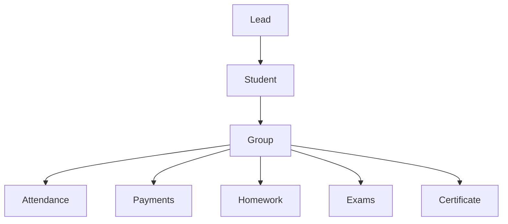

# 📘 EduFlow CRM Blueprint v1.0

Ushbu hujjat **EduFlow CRM** loyihasi davomida o'zgarmaydigan asosiy arxitektura va loyiha qoidalarini belgilaydi.

---

## 1. Asosiy Tamoyillar
- **Tezlik:** Yuqori unumdorlik va bir zumda javob beruvchi SPA (Single Page Application) arxitekturasi.
- **Xavfsizlik:** RLS (Row Level Security) va rollarga asoslangan ruxsatnomalar (RBAC).
- **Cross-Platform:** Telefon, planshet va kompyuterlarda bir xil qulaylik va moslashuvchanlik.
- **Offline First:** Internet sekin bo'lsa yoki uzilsa ham uzluksiz ishlash va avtomatik sinxronizatsiya.
- **AI Integration:** AI Command Center va ma'lumotlar tahlili.
- **Modullilik va API:** Kelajakda mobil ilova va n8n avtomatlashtirishni ulash uchun tayyor REST API modeli.

---

## 2. Tizim Rollari (RBAC)
1. 👑 **Super Admin:** Barcha filiallar, sozlamalar va moliya ustidan to'liq nazorat.
2. 🏢 **Filial Admini:** Biriktirilgan filial faoliyati, xodimlar va o'quvchilarni boshqarish.
3. 👨‍💼 **Menejer:** O'quvchilar, guruhlar va lidlar zanjirini yuritish.
4. 👨‍🏫 **O'qituvchi:** O'z guruhlari, davomat, uy vazifalari va baholash.
5. 💰 **Kassir:** To'lovlarni qabul qilish, kvitansiyalar berish va qarzdorlikni kuzatish.
6. 📞 **Call Center Operator:** Lidlar va yangi murojaatlar bilan ishlash.
7. 👨‍🎓 **O'quvchi:** Dars jadvali, davomat, to'lovlar va materiallar.
8. 👨‍👩‍👧 **Ota-ona:** Farzandining davomati, baholari va to'lov holatini kuzatish.

---

## 3. Modullar Bog'liqligi

---

## 4. Unikal Raqamlash Standarti (Auto-ID)
- `ST-000001` — O'quvchi (Student)
- `TE-000001` — O'qituvchi (Teacher)
- `GR-000001` — Guruh (Group)
- `PM-000001` — To'lov (Payment)
- `LS-000001` — Dars (Lesson)
- `LE-000001` — Murojaat/Lid (Lead)

---

## 5. Modul Ishlab Chiqish Standart Tartibi
Every module MUST strictly follow these 8 steps:
1. 📋 **Talablar:** Modul maqsadini belgilash.
2. 🗄️ **Database:** SQL jadvallari va indekslar.
3. ⚙️ **API:** Servis va REST endpointlar.
4. 🎨 **Frontend:** Interfeys va komponentlar.
5. 🤖 **AI Integratsiyasi:** Aqlli tahlil va tavsiyalar.
6. 🔄 **n8n Avtomatlashtirish:** Telegram/SMS triggerlar.
7. 🧪 **Test:** Funksional va offline test.
8. 📖 **Qo'llanma:** Foydalanish bo'yicha hujjat.
